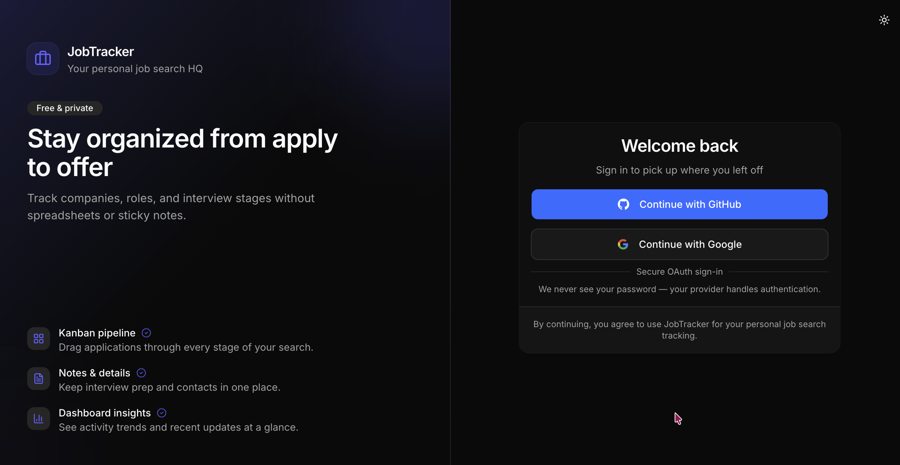
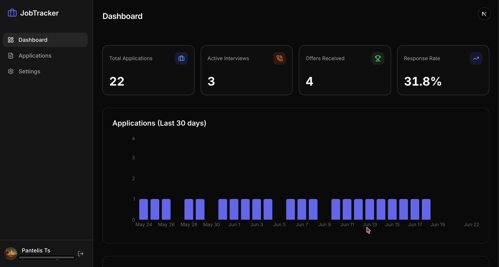
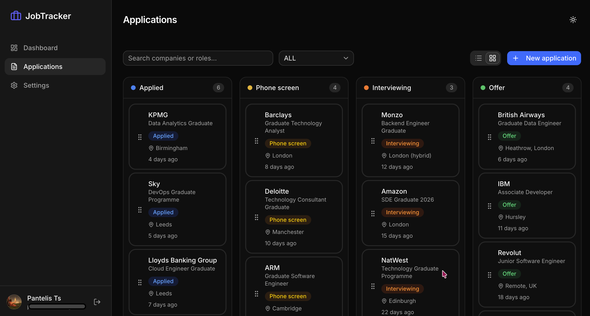
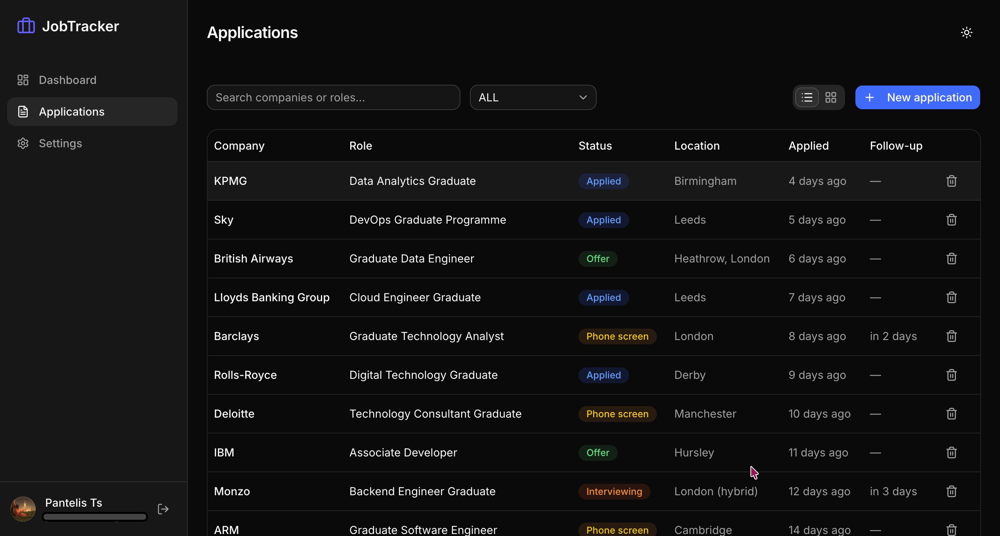
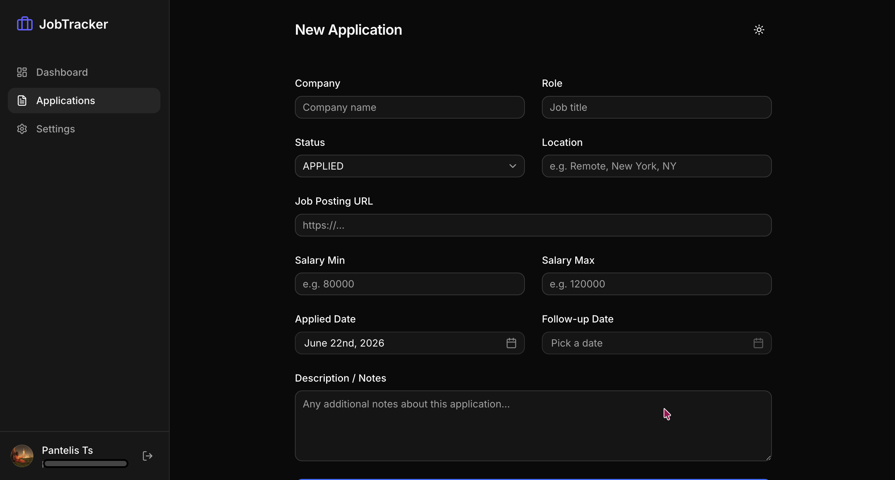
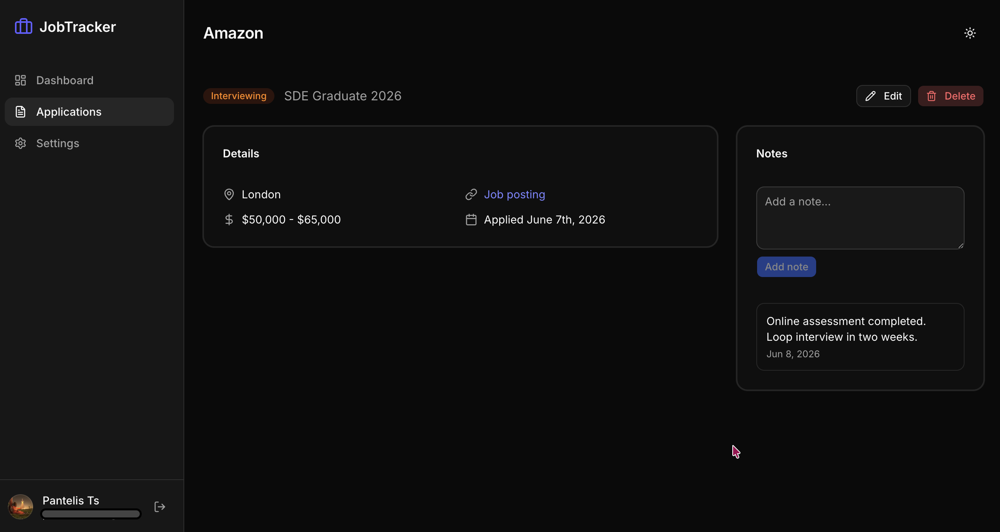
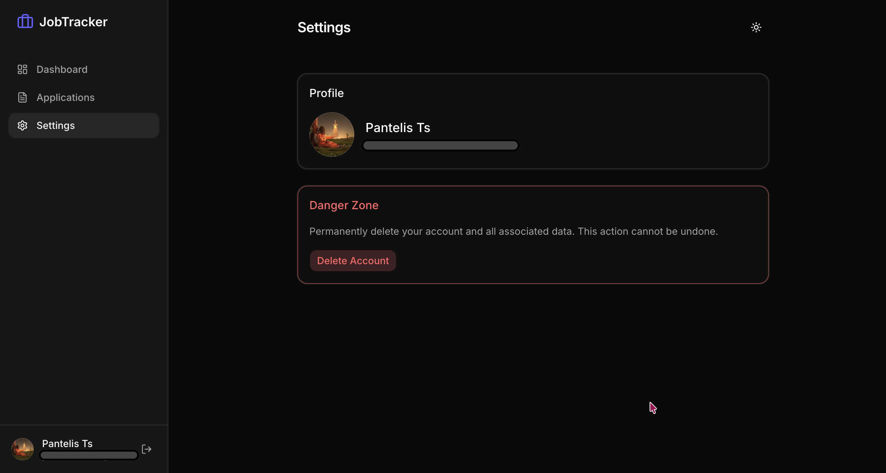

# Job Application Tracker

[](https://job-application-tracker.vercel.app)
[](LICENSE)
[](https://nextjs.org/)
[](https://react.dev/)
[](https://www.typescriptlang.org/)
[](https://www.prisma.io/)
[](https://tailwindcss.com/)

A full-stack web application to track and manage job applications throughout the hiring process. Built with Next.js 16, React 19, and PostgreSQL.

## Screenshots

### Landing page

Sign in with GitHub or Google — no passwords stored by the app.



| Dashboard | Kanban board |
| :---: | :---: |
|  |  |

| List view | New application |
| :---: | :---: |
|  |  |

| Application detail | Settings |
| :---: | :---: |
|  |  |

## Features

- **Dashboard**: overview with stats and charts showing application progress
- **Application Management**: add, edit, and delete job applications
- **Kanban Board**: drag-and-drop board to visually manage application stages
- **Table View**: sortable, filterable table for quick scanning
- **Status Tracking**: track applications through Applied → Phone Screen → Interviewing → Offer / Rejected / Withdrawn
- **Notes**: add notes to each application for interview prep and follow-ups
- **Authentication**: sign in with GitHub or Google via NextAuth.js
- **Dark Mode**: full light and dark mode support

## Tech Stack

| Layer | Technology |
|-------|-----------|
| Framework | Next.js 16 (App Router, Turbopack) |
| Frontend | React 19, Tailwind CSS, shadcn/ui |
| Backend | Next.js API Routes |
| Database | PostgreSQL (Neon Serverless) |
| ORM | Prisma 7 |
| Auth | NextAuth.js v5 |
| Charts | Recharts |
| Drag & Drop | dnd-kit |
| Forms | React Hook Form + Zod |
| Deployment | Vercel |

## Getting Started

### Prerequisites

- Node.js 20.19+ (required by Prisma 7 and Next.js 16)
- pnpm
- A PostgreSQL database (e.g. [Neon](https://neon.tech))

### Setup

1. **Clone the repo**

   ```bash
   git clone https://github.com/PantelisTsagkas/job-application-tracker.git
   cd job-application-tracker
   ```

2. **Install dependencies**

   ```bash
   pnpm install
   ```

3. **Set up at least one OAuth provider**

   **GitHub** (at [github.com/settings/applications/new](https://github.com/settings/applications/new)):
   - Homepage URL: `http://localhost:3000`
   - Authorization callback URL: `http://localhost:3000/api/auth/callback/github`

   GitHub OAuth Apps allow only one callback URL, so create a separate app for production.

   **Google** (at [Google Cloud Console](https://console.cloud.google.com/apis/credentials), create an OAuth client ID):
   - Authorized redirect URI: `http://localhost:3000/api/auth/callback/google`

   A single Google client supports multiple redirect URIs, so the same one works for local and production.

4. **Set up environment variables**

   Create a `.env.local` file. `DATABASE_URL` and `AUTH_SECRET` are required, plus the credentials for whichever provider(s) you configured:

   ```env
   DATABASE_URL="postgresql://..."
   AUTH_SECRET="..."   # generate with: openssl rand -base64 32

   GITHUB_ID="..."
   GITHUB_SECRET="..."

   GOOGLE_ID="..."
   GOOGLE_SECRET="..."
   ```

5. **Push the schema to your database**

   ```bash
   npx prisma db push
   ```

6. **Run the dev server**

   ```bash
   pnpm dev
   ```

   Open [http://localhost:3000](http://localhost:3000)

### Demo data (optional)

For screenshots or demos, seed realistic sample applications after signing in once:

```bash
pnpm seed
```

Replace existing applications:

```bash
pnpm seed -- --fresh
```

Target a specific account:

```bash
pnpm seed -- --email you@example.com
```

## Scripts

| Command | Description |
|---------|-------------|
| `pnpm dev` | Start development server |
| `pnpm build` | Build for production |
| `pnpm start` | Start production server |
| `pnpm lint` | Run ESLint |
| `pnpm seed` | Seed demo applications for the signed-in user |

## Project Structure

```
src/
├── app/
│   ├── (auth)/          # Login page
│   ├── (dashboard)/     # Main app pages
│   └── api/             # API routes
├── components/
│   ├── applications/    # App-specific components
│   ├── dashboard/       # Dashboard widgets
│   ├── layout/          # Header, Sidebar
│   └── ui/              # shadcn/ui primitives
├── lib/                 # Prisma client, auth config, utils
└── types/               # TypeScript types
```

## License

MIT
